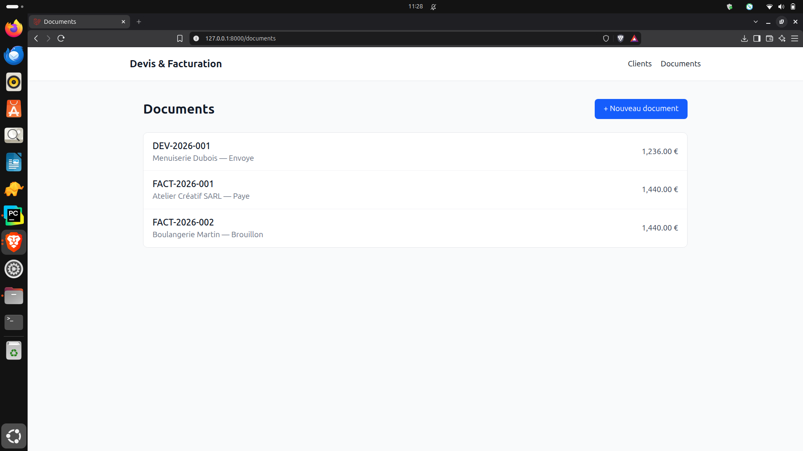
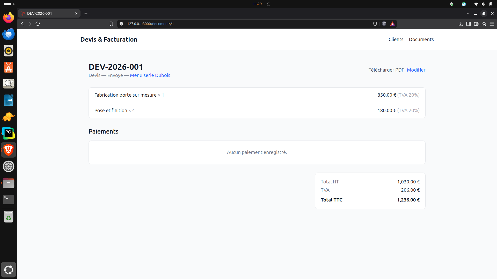
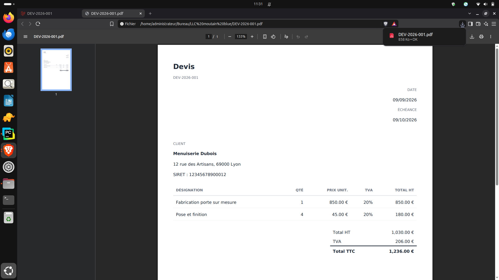

# Invoicing & Quotes

Quote and invoice management application built with Laravel, designed for small businesses and freelancers.

## Use case

A freelancer or small business needs to create quotes, convert them into invoices once accepted, track received payments, and produce compliant PDF documents.

## Features

- Client management (full CRUD)
- Quote creation with multiple line items and automatic subtotal/VAT/total calculation
- One-click quote-to-invoice conversion, with gapless legal sequential numbering
- Status tracking (draft, sent, accepted, paid...)
- Payment recording (partial or full), with automatic "paid" status update
- PDF generation for quotes and invoices
- User authentication (Laravel Breeze)
- Responsive interface (Tailwind CSS)

## Tech stack

- Laravel 13
- Blade + Tailwind CSS
- SQLite
- Laravel Breeze (authentication)
- DomPDF for document generation

## Installation

\`\`\`bash
git clone https://github.com/Mountainbluesun/devis_facturation
cd devis_facturation
composer install
npm install
cp .env.example .env
php artisan key:generate
touch database/database.sqlite
php artisan migrate
php artisan db:seed --class=DemoSeeder
npm run build
php artisan serve
\`\`\`

## Screenshots

### Document list

### Invoice detail with payments

### Generated invoice PDF

## Known limitations / roadmap

- No credit notes (cancelling an issued invoice)
- No accounting export

